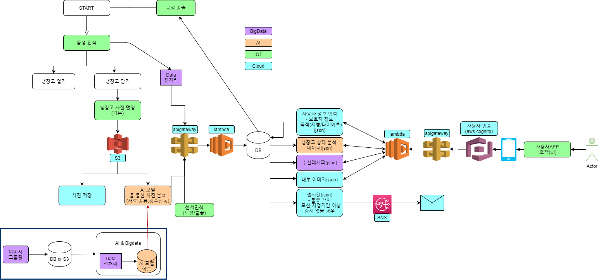

# 구체화 및 사전준비 단계

---

## NOV23

### WBS 작성

https://trello.com/b/iZWAt1ie/smart-refrigerator

### 팀명 확정

* **최**수녕
* **강**륜화
* **류**제룡
* **김**지현
* **박**근웅
* 팀원 모두의 성을 따 **최강류김박** The mightiest Kim-Park으로 결정

### 시스템 플로우 작성

### 냉장고 기능 구체화

* **타겟 - 1인가구, 특히 노인**
  * 모션감지 센서 -> 하루동안 감지된 모션이 없다면 보호자 및 근처 파출소에 알람
    * 외출모드를 켜면 센서에 모션이 감지되지 않아도 연락가지 않도록
  * 노인분들은 당뇨/비만 등 지병이 많음
    * 지병에 맞춘 레시피 추천
    * 다이어트 등 노인이 아닌 계층의 특수 수요에 맞춘 레시피도 추천 가능
* **기본 기능**
  * 냉장고에 있는 식재료 종류 및 개수 조회 (음성, 어플, 웹 등)
    * 어플리케이션에 유통기한 순서대로 정렬
    * 음성챗봇은 식재료 이름+수량으로 대답
    * 웹은 냉장고에 부착된 led로
  * 특정 식재료가 있는지 확인 할 수 있는 질문 - 음성 챗봇
  * 현재 재료에 맞는 레시피 추천 / 유통기한 고려
  * 특정 식재료가 떨어지면 어플리케이션에 팝업 알림
  * 문 닫아줘/열어줘 말하면 자동 여닫힘 & 앱에서 버튼으로도 제어 가능
  * 문이 닫힐 때 마다 카메라에 촬영된 사진 조회
* **IoT 하드웨어**
  * 금전적 & 현실적 문제로 냉장고는 한 칸으로
  * 아크릴 + LCD
* **회원가입**
  * 웹: 냉장고에 부착되어있기 때문에 회원 로그인 필요 없음
  * 앱: 여러 사람이 사용해야 함 -> 냉장고 QR코드를 만들어서 회원가입/로그인
* **시간이 남는다면(희망사항) 할 것들**
  * 날씨 알림
  * 자동 주문 시스템
  * 화재감지(불꽃/온습도)

### 기타 논의 사항

* 만약 가족 구성원을 여럿 잡아놓고 묶어서 데이터를 분석한다면 가족 구성원에 따른 소비패턴 분석 등도 가능

  -> 마트나 기업 등에 정보를 제공해서 마케팅적으로도 활용 가능할 것

* 다이어트, 당뇨등에 중점을 둔다면 기업보다는 고객 개인에게 정보를 제공, 관리를 도와주는 디바이스
* 고려해야 할 점
  * 이 냉장고의 구매층을 노인으로 한정지을 것인가?
  * 모든 연령대가 구매 가능하지만, 나이를 입력받는가?
  * 병명만 입력받는가?
  * 모든 연령대 구매 가능, 나이 입력, 그 후에 노인이라면 병명을 입력받는가?
* 식품 추천 기능 (ex. 단백질)
  * 냉장고에 있는 음식들 중 계란을 타겟으로
  * 계란이 들어간 레시피 중 냉장고에 있는 재료들과 매치되는 레시피 필터링
    * 유통기한이 임박한 순서대로
  * 통틀어 레시피를 묶기
* 모든 식자재에 대해서 구현할 수 없으니 음식과 재료를 한정시키자!

### 참고자료

https://m.blog.naver.com/PostView.nhn?blogId=jjm423&logNo=222149139794&proxyReferer=&proxyReferer=https:%2F%2Fblog.naver.com%2Fjjm423%2F222149139794

https://www.youtube.com/watch?v=LIwQUT7E0ZE