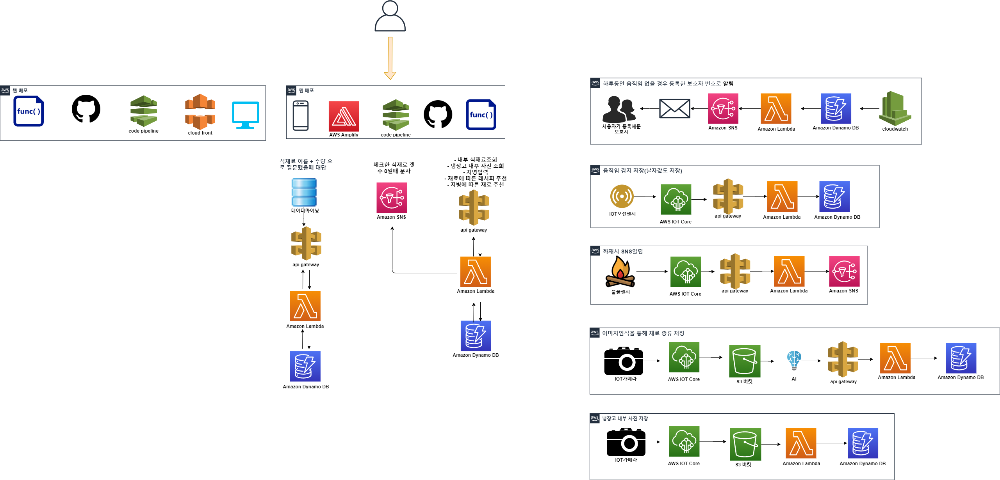
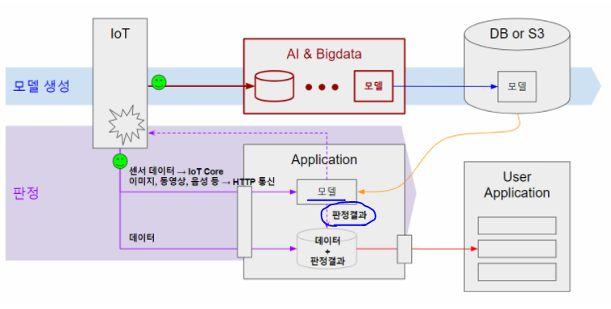
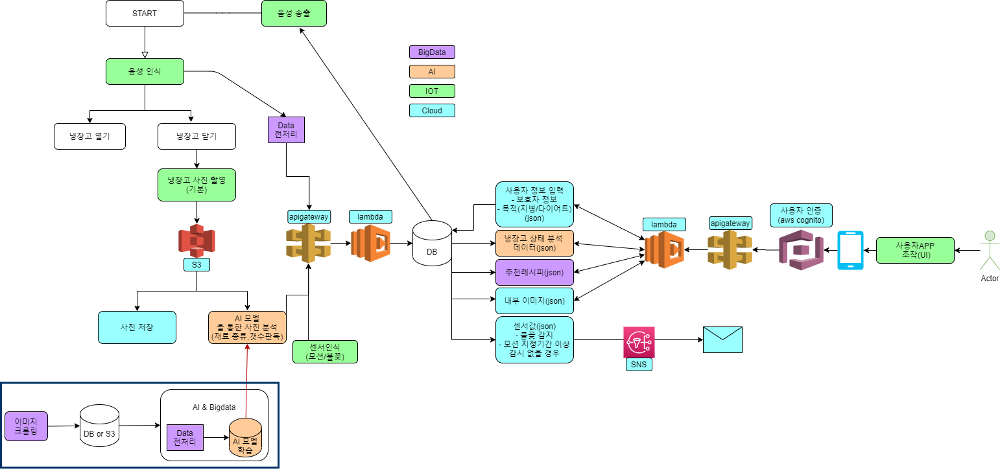

# 구체화 및 사전준비 단계

---

## NOV23

### 팀명 확정

* **최**수녕
* **강**륜화
* **류**제룡
* **김**지현
* **박**근웅
* 팀원 모두의 성을 따 **최강류김박** The mightiest Kim-Park으로 결정

### 냉장고 기능 구체화

* **타겟 - 1인가구, 특히 노인**
  * 모션감지 센서 -> 하루동안 감지된 모션이 없다면 보호자 및 근처 파출소에 알람
    * 외출모드를 켜면 센서에 모션이 감지되지 않아도 연락가지 않도록
  * 노인분들은 당뇨/비만 등 지병이 많음
    * 지병에 맞춘 레시피 추천
    * 다이어트 등 노인이 아닌 계층의 특수 수요에 맞춘 레시피도 추천 가능
* **기본 기능**
  * 냉장고에 있는 식재료 종류 및 개수 조회 (음성, 어플, 웹 등)
    * 어플리케이션에 유통기한 순서대로 정렬
    * 음성챗봇은 식재료 이름+수량으로 대답
    * 웹은 냉장고에 부착된 led로
  * 특정 식재료가 있는지 확인 할 수 있는 질문 - 음성 챗봇
  * 현재 재료에 맞는 레시피 추천 / 유통기한 고려
  * 특정 식재료가 떨어지면 어플리케이션에 팝업 알림
  * 문 닫아줘/열어줘 말하면 자동 여닫힘 & 앱에서 버튼으로도 제어 가능
  * 문이 닫힐 때 마다 카메라에 촬영된 사진 조회
* **IoT 하드웨어**
  * 금전적 & 현실적 문제로 냉장고는 한 칸으로
  * 아크릴 + LCD
* **회원가입**
  * 웹: 냉장고에 부착되어있기 때문에 회원 로그인 필요 없음
  * 앱: 여러 사람이 사용해야 함 -> 냉장고 QR코드를 만들어서 회원가입/로그인
* **시간이 남는다면(희망사항) 할 것들**
  * 날씨 알림
  * 자동 주문 시스템
  * 화재감지(불꽃/온습도)

### 기타 논의 사항

* 만약 가족 구성원을 여럿 잡아놓고 묶어서 데이터를 분석한다면 가족 구성원에 따른 소비패턴 분석 등도 가능

  -> 마트나 기업 등에 정보를 제공해서 마케팅적으로도 활용 가능할 것

* 다이어트, 당뇨등에 중점을 둔다면 기업보다는 고객 개인에게 정보를 제공, 관리를 도와주는 디바이스
* 고려해야 할 점
  * 이 냉장고의 구매층을 노인으로 한정지을 것인가?
  * 모든 연령대가 구매 가능하지만, 나이를 입력받는가?
  * 병명만 입력받는가?
  * 모든 연령대 구매 가능, 나이 입력, 그 후에 노인이라면 병명을 입력받는가?
* 식품 추천 기능 (ex. 단백질)
  * 냉장고에 있는 음식들 중 계란을 타겟으로
  * 계란이 들어간 레시피 중 냉장고에 있는 재료들과 매치되는 레시피 필터링
    * 유통기한이 임박한 순서대로
  * 통틀어 레시피를 묶기
* 모든 식자재에 대해서 구현할 수 없으니 음식과 재료를 한정시키자!

### 참고자료

https://m.blog.naver.com/PostView.nhn?blogId=jjm423&logNo=222149139794&proxyReferer=&proxyReferer=https:%2F%2Fblog.naver.com%2Fjjm423%2F222149139794

https://www.youtube.com/watch?v=LIwQUT7E0ZE

---

## NOV24

### WBS 작성

https://trello.com/b/iZWAt1ie/smart-refrigerator

### 기획안 작성

https://docs.google.com/document/d/1eXv47uANkFSXV7JfyVx2gC2OmVvpu5J0/edit#

### 기타 논의사항

* 냉장고를 아크릴로 제작하려 했으나, 예산이 5만원으로 제한되었다

  아크릴 가공비까지 합치면 5만원가량 나오기 때문에 포기 -> 우드락으로 전환

* 여러 재료가 들어가는것을 보여줘야 하니 보통의 냉장고처럼 세로로 긴 것 보다는 가로로 납작하게 하자
* 냉장고 속 전구는 문 열리는 순간부터 문이 닫히고 사진 찍히는 직후까지 켰다가 꺼지도록 조절

---

## NOV25

### 클라우드 아키텍처 작성

### DB설계 시작

* 고려사항
  * 회원 정보 테이블 - 한 회원 안에 가족 구성원을 모두 담을 것인가?
  * 재료 유통기한도 포함시킬것인가?
  * 구성원 핸드폰 번호, 어떤 관계인지 정도는 정리할 것
  * 어떤 DB를 쓸까? - 관계가 많으면 Dynamo 대신에 RDS로

### IoT Core 사용 이유

IoT장비들(센서들)은 통신할 때 MQTT프로토콜을 사용한다.

but 우리가 필요로 하는 것은 http 프로토콜

-> IoT Core가 MQTT로 통신하는 것을수집해서 http로 전송할 수 있게 중개해주는 기능을 제공

IoT Core에서 Greengrass SDK도 제공하는데, 이것을 깔면 MQTT프로토콜을 이해할 수 있다

클라우드에서 가이드해줘야겠지만, 라즈베리파이에서 설정하는게 있기 때문에 IoT의 역할이 될 것.

---

## NOV26

**최수녕**

* 아키텍처 마무리
* 리액트 세팅 및 레이아웃 설계

**강륜화**

* 클라우드 아키텍처 이해
* DB설계
* 노션 정리해서 깃허브에 연동

**류제룡**

* 식재료 데이터 크롤링
* 식재료 데이터와 레시피 데이터 유사도 검사

**김지현**

* IoT부품 회수
* 라즈베리파이 google assistant로 설치 완료  - but 코드가 무거움
* Google speech api로 음성인식방법 변경
* 라즈베리파이에 Google Speech SDK 설치 완료 후 음성인식 구동되는 것 까지 확인

**박근웅**

* AI반에서 제공된 AWS 권한문제 확인

* Object Detection 방법 조사

  * Proposal-free method: SSD, YOLO, RetinaNet
  * Proposal-based method: Fast/Faster R-CNN, R-FCN

* 논문 조사결과 - 카메라를 어디에 설치하느냐가 결과에 영향이 큼

  문에 설치하는 경우 이미지에 왜곡이 생겨 Image Transform하는 model이 별도로 필요

---

## NOV27

**최수녕**

* React 레이아웃 만들기
* DynamoDB  쿼리문 찾아보기
* Dynamo와 Lambda 연동법 찾아보기

**강륜화**

* DB설계 끝내기
* DynamoDB 초기세팅
* AWS 클라우드 플랫폼 세미나 참석

**류제룡**

* 레시피 크롤링
* centos 환경 selenium 설치

**김지현**

* 라즈베리파이에서 스피커 인식 안되는 문제 해결
* 스피커 음질 떨림 해결
* 음성 합성 완료

**박근웅**

* DB설계 끝내기

* OpenCV를 이용한 YOLO TEST

  * opencv 자체가 지원하는 imshow의 경우 aws에서 사용이 불가능함.

    단순한 문제가 아니므로 포기하고 matplotlib imshow로 대체해서 사용

### AI 강사님의 말씀

지금까지 AI반은 모델을 학습하면서 저장하는 방식으로 공모전을 진행했다.

1. 데이터를 이용한 학습
2. 학습된 모델을 이용한 Prediction

- 학습과 예측이 동시에 진행되어야 한다.

  - 데이터를 IoT에서 받아서 지속적으로 모델 학습 ( AWS서버 ) - `(1)`

    : 클라우드가 들어올 필요가 없음, 전체 프로젝트에는 사용 안함, 오직 모델 학습용

  - 모델을 이용해서 prediction

    전체 클라우드 시스템에 올라가야 함

    이 모델은 WAS( such as 장고 ), 안드로이드 시스템에 올라가 있으면 된다-`(2)`

- 데이터 땡겨 오는 거는 클라우드 반에게 배워서 AI반이 하는 것이 좋음

  `(1)` : 데이터를 어떻게 받아올 건지는...  알아서 해결

S3에 있는 데이터를 받아 올건지, 빅데이터반이 사용하고 있는 마리아디비에서 받아올지는 프로젝트 설계마다 상이하니 그에 맞춰 처리해야 한다.

- `(2)`안드로이드, 장고 같은 곳에 어떻게 올릴 것 인지도 상의를 통해 알아 봐야 함. 

  AI가 맡은 model을 Library처럼 들어가서 사용 해야 함

### IoT 강사님의 말씀

단순히 센서값 주고받고, 사진 몇 장만 서버로 보내는 것이라면 IoT core를 굳이 사용하지 않고 s3버킷에 업로드.

IoT core는 사진의 갯수가 많거나 영상을 보내는 경우에 이용하면 좋다!

### 클라우드 강사님의 말씀

IoT가 데이터를 주면 모델을 생성하는 것은 AI와 BD가 알아서 하는것이다

클라우드반의 역할은  DB나 S3로 받는것

---

## NOV28

### 시스템 플로우 작성

### 전체 피드백

* DB작성은 전체 플로우를 그리고 난 뒤에 하도록
* 관계형 데이터베이스가 적합할 것 같다
* 서비스 시나리오는 선택이 아닌 필수
* 차별화 포인트 주제 꼭 넣어서 말하기
* 네 가지 분야 모두 고려하여 철학적, 마케팅적 측면에서 스토리텔링 생각해볼 것
* 기능 구현이 지금은 완벽하게 다 되지 않더라도, '나중에 더 ~할것입니다' 라면서 기술에 대해 정확하게 설명해주면 사용자 입장에서 신뢰도 상승
* 앱에서 식재료를 리얼타임으로 시각화할 수 있으면 좋겠다

### 빅데이터 피드백

* 냉장고 속 식료품의 변동데이터를 통해 사용자 선호도 데이터를 축척 및 활용할 수 있다

* 회원가입시 연령대, 성별을 입력하면 나이대별/성별 선호데이터 축척 가능

  -> 기업 입장에서 활용가치 높아보임

* 분석 이슈 추가

### AI 피드백

* 유통 물류 분류 AI 서치 / 시나리오 정리

### IoT 피드백

* 스마트 냉장고 자체에 대한 도전은 약 1n년 전부터 있었는데, 별다른 성과가 없다 -> 문제점 파악할 것
* 이용자들이 냉장고 안에 식재료를 고스란히 넣지 않고 봉지 째 넣는 등 여러 변수를 고려해야 한다
* 내용이 지나치게 방대하므로 여러 기능들 중 몇 개 item을 잡아서 제작하자

###  클라우드 피드백

- AWS amplify vs GCP Firebase vs Azure mobileapp

  https://p3420a1.wixsite.com/preeti/post/aws-amplify-vs-firebase

- 사용자 인증을 위해 cognito필요

- 한번에 볼 수 있는 아키텍쳐 만들면 좋을 것 같다.

- Amplify는 스마트메이커와 비슷한 것. 굳이 이걸로 할 필요 모르겠다고 하심

- 흐름도를 보고 각자 해야할 파트를 분명히 정해라

- IOT Core나 Greengrass를 사용하지 않아도 좋지만 사용하는게 좋다 -> 통신 부분 알아서 해줌

  그 부분을 자기가 다 구현할 수 있거나 지금 이 기능에서만 시연하는거면 안해도 되겠지만,

  실제론 저것 외에 신경쓸 것들이 너무 많기 때문에 사용하면 좋겠다.

  하지만 어렵기때문에 사용하게되면 큰 난관을 겪게 될 것. (?)

---

## NOV30

### 데이터베이스 설계

