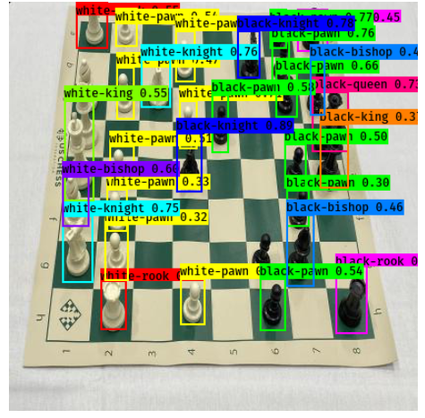
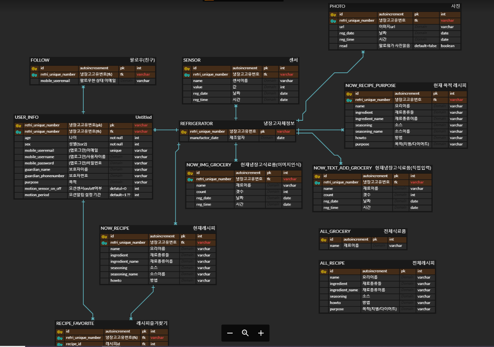

# 개발 1주차

## DEC01

**최수녕**

* AWS cognito 진행

**강륜화**

* 깃허브 repository 생성

* AWS 계정 발급
* AWS RDS생성

**류제룡**

* 정적크롤링 코드 만들기 & 시간개선

**김지현**

* 서브모터로 문 제어하는 코딩 완료 및 확인 

**박근웅**

* Keras-YOLO test & custom
* CNTK 데이터 다운로드

---

## DEC02

### 어플리케이션 설계

https://ovenapp.io/view/Vwcg2anAMp5qpBkgox6DhfT8SrdNWI8Z/1ZPVQ

**최수녕**

* Amplify Cognito 속성 바꿔서 Kotlin으로 적용
  * DB연동 찾아보기
* IAM 사용자 생성

**강륜화**

* RDS에 테스트 데이터 넣어서 람다함수 테스트

**류제룡**

* 식료품 목록 선정
* 레시피 크롤링 완료
* 코사인 유사도 공부

**김지현**

* 카카오오븐으로 앱 설계하기
* S3버킷에 사진 업로드 확인 완료
* 코틀린 공부

**박근웅**

* LabelImg 설치 완료
* Keras-YOLO chess dataset으로 fine-tune 완료

### 기타 고려사항

* 냉장고에 필름지 붙여서 반짝반짝하게 만들까?
* 냉장고 안 식재료 위치 x y 좌표값 받아서 그대로 어플리케이션에 찍히도록
* 인스타 스토리처럼 가족구성원 냉장고 변동되면 확인가능하게
* 동절기/하절기에 맞춰 냉장고 온도 조절
* 레시피는 음성으로 받아보는가 어플로 받아보는가?

* AWS 회원가입 기능에 대해

  * AWS에서 제공하는 회원가입 기능은 우리DB에 저장되는 것이 아니라 AWS자체 DB에 저장

  * AWS DB와 조인을 할 수는 없고, 토큰 값 받아서 사용자 정보를 보는 것 뿐

  * 사용자 테이블에 있는 특정 정보를 불러오고 싶을 때 어플리케이션에서 json 형식으로 사용자에 대한 정보를 따올 뿐, '나'에게는 정보가 없어서 필요한 것들을 일일이 넘겨줘야한다

  * 우리 DB에 있으면 앱에서 사용자 아이디만 넘겨주면 조회 가능한데...

    -> 그래서 고민!

---

## DEC03

### ERD 작성

---

### backend 해야할 일 정리

#### (back)필수 기능

- cognito로도 도전해보기
- 추천레시피 저장(빅데이터 완료된 후 가능)
- 회원 정보 조회
  - 조회값 : 일단 비밀번호 뺴고 다
  - 받는 값 : email
- 회원 정보 수정
  - update 가능 값 : 이메일, 비밀번호 빼고 다!!
  - 받는 값 : email
- 추천레시피 조회 /  목적에 맞는 추천레시피 조회
  - 조건 : 레시피는 현재 레시피 테이블에서 가장 최근 날짜것만 조회해야함
- 회원가입(보류)
- 로그인(보류)
- S3데이터 AI(Django로 넘겨주기)(람다에서 작성)
- 냉장고 사진 저장(s3 trigger사용)(람다에서 작성)
- 현재 냉장고 정보 저장
- 냉장고 재료 조회
- (불꽃/모션/온도/습도) 센서값 삽입(람다에서 작성)
- 불꽃 센서 작동시 문자메세지 보내기(람다에서 작성)
- 모션 센서 ON상태 > 설정기간동안 작동 없을 시 문자메세지 보내기 (람다에서 작성)
- 외출 모드ON OFF 변경
- 냉장고 번호 유효성 검사

#### (back)후순위 기능

- 친구 이메일로 조회시 당사자 이름, 이메일 정보 조회
- 회원 사진 등록/수정
- 전체 재료 이름 조회
- 사용자가 입력한 재료 삽입
- 사용자가 입력한 재료 조회
- 추천레시피 즐겨찾기
- 즐겨찾기한 추천레시피 조회 
- 친구 팔로우/언팔로우
- 팔로우 된 상태일 때 친구 냉장고 가장최근 사진 조회
  - read안읽고, 최신사진순으로
- 사진 읽음 표시

---

**최수녕**

* 세부기능 정리 및 분배
* 람다함수 작성

**강륜화**

* aws lambda공부
* django와 연동 시스템 공부

**류제룡**

* 레시피데이터 spark로 처리
* 학습 이미지 크롤링

**김지현**

* 하드웨어 손보기
* 앱 구성 및 기능 구체화

**박근웅**

* annotation making코드 완성
* LambelImg test
* 데이터 수집 시작

---

## DEC04

### 멘토님께서 주신 링크

https://trackit.io/aws-api-gateway-101-create-an-api-with-python-cognito-and-serverless/

-> 사용자pool을 관리하고 싶다고 할때는 SaasIdentity형태로 관리해야 합니다. (??? 이해 못함)

---

**최수녕**

* 람다함수 작성
* SNS연동 및 S3정보 가져오는 테스트

**강륜화**

* AWS SNS 연동 확인
* AWS RDS MariaDB로 생성

**류제룡**

* 이미지 크롤링 및 분류
* 코사인유사도를 사용한 레시피 추천 코드 작성

**김지현**

* 스플래시 화면 구현
* 메인화면 리사이클러뷰 스토리

**박근웅**

* 이미지 데이터 다운로드
* 이미지 레이블링 및 분류

---

### 논의사항

* 현재 냉장고에서 사진 체크 여부를 꼭 테이블에 넣는 방법밖에 없는가?

  * 어플리케이션 내부 DB를 써도 된다!

    안드로이드에서는 서버 없어도 자체 DB가 있어서 값을 저장해준다

    대신 이 값은 안드로이드 어플을 삭제하면 초기화된다

* 크롤링을 주로 영어로 해오는데 우리가 생각하는 한국 야채품종 영문 표기법과 실제 해당 품종과 다르다
* 과일끼리 겹쳐있는것을은 labeling하기가 힘들어서 지양하는것이 좋다
* 불꽃센서 감지시에 문자를 본인에게만 가게 할지, 본인+보호자에게 가게 할지 생각해봐야 한다
* 식재료를 카메라가 인식한것만 되게 할 것인가, 사용자가 직접 입력할 수 있도록 할 것인가?
  * 만약 사용자가 입력할 수 있다면 카메라가 인식한 식재료와 별도로 띄울 것인가?
  * 같이 띄운다면, 어느 쪽 데이터에 우선순위가 잡혀있는가? 어느쪽을 더 정확한 것으로 볼 것인가?
  * 덮어씌운다면, 어떻게 덮어씌울것인가?
  * 유통기한 표기를 한다면 특히 더 복잡해질 것

---

## DEC05

### 클라우드 멘토링

- 사용자 pool과 db저장은 관련이 없다

- db에 내가 사용자를 넣었다는 것은 어떤 service를 하려고 하는것.

  이 사용자 정보와 login을 했을 때 cognito와 연결이 되려면 사용자 pool을 등록할 때 == create user? 를 누를 때 마다 내 id나 다른 user의 email을 통해 password key? pool? 을 구성할 수 있어야 한다

- 사용자를 내 service와 연동하려면 저 사용자 pool이 우리쪽 service에 있어야 한다.

- 사용자 pool을 만들 때 등록하려고 했던 인증에 필요한 key (email등...)랑 우리쪽이랑 연동을 시켜야한다.

  그것을 등록하는 과정, 인증과정에서 token이 발생을 하고 그걸로 우리쪽에 접근을 하는 것.

- https://www.itworld.co.kr/news/101255

- 핸드폰 자체가 인증을 받은 기기인데 다시 id 값 등을 받는 것은 좋은방식이 아니다.

- domain도 설계가 되어야 한다.

- fridge가 fk pk가 될게 아니라, user id가 메인이 되어야 한다.

### 논의사항

* follow 테이블에 내가 읽은 스토리를 구분할 수 있도록 read column을 넣어서 boolean type으로 만들자.
* 날씨 api도 가져와서 우리 기능에 추가해볼까? 너무 산만한가?
* 사용자 테이블이 우리 DB에 있어서 조인은 신경쓰지 않아도 됨.. 인증만 cognito로 하자
* DB를 갈아엎어야 한다.